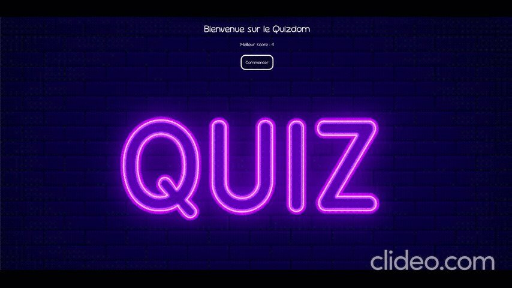

🧠 Quiz de Culture Générale

Un quiz interactif en ligne composé de 10 questions de culture générale, développé en HTML, CSS et JavaScript.
Le but : tester vos connaissances tout en profitant d’une interface simple et agréable !

📂 Structure du projet

📁 quiz-culture-generale/
│
├── index.html          # Page principale du quiz
│
├── css/
│   └── style.css       # Feuille de style du projet
│
├── js/
│   └── script.js       # Logique du quiz (questions, score, interactions)
│
└── .gitignore          # Fichiers/dossiers à ignorer par Git

🎮 Fonctionnalités

✅ 10 questions aléatoires de culture générale
🧩 Interface utilisateur intuitive et responsive
🕒 Chronomètre (facultatif selon ton implémentation)
⭐ Affichage du score final
🔁 Option pour rejouer à la fin du quiz

💻 Technologies utilisées
HTML5 – Structure de la page
CSS3 – Mise en forme et design responsive
JavaScript (ES6) – Logique du quiz et interactions dynamiques

🚀 Installation et utilisation
Cloner le dépôt :
git clone https://github.com/<ton-utilisateur>/<nom-du-repo>.git
Ouvrir le projet :
Ouvre le fichier index.html directement dans ton navigateur.
Jouer :
Réponds aux 10 questions et découvre ton score final 

🧩 Améliorations possibles
Ajouter une base de données pour stocker les scores
Intégrer des catégories de quiz (histoire, sciences, sport…)
Ajouter des effets sonores et animations
Permettre de partager son score sur les réseaux sociaux

📜 Licence
Ce projet est distribué sous licence MIT.
Tu peux l’utiliser, le modifier et le redistribuer librement avec attribution.
